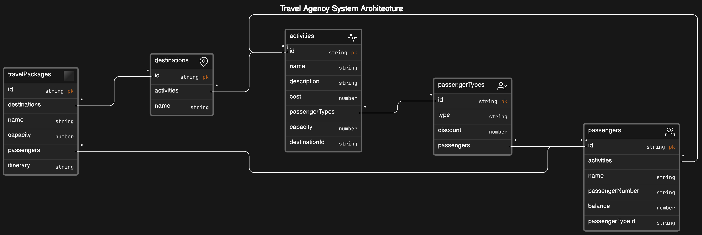

# Nymble

Nymble is a software system designed to help travel agencies manage their travel packages' itinerary and passengers effectively. It provides functionalities for maintaining travel packages, destinations, activities, and passengers, along with features for printing itinerary details, passenger lists, activity details, and available activities.

## System Architecture

The diagram above illustrates the architecture of the Nymble system, including the models, their field types, and their relationships.

## Features

- **Travel Packages Management**: Create, update, delete travel packages with details such as name, passenger capacity, and itinerary.
- **Destination Management**: Manage destinations with details like name and associated activities.
- **Activity Management**: Maintain activities with information including name, description, cost, and capacity, linked to specific destinations.
- **Passenger Management**: Handle passenger details, including name, passenger number, and passenger type (standard, gold, or premium).
- **Print Functionality**: Print itinerary details, passenger lists, activity details, and available activities.

## Technologies Used

- **Java**: The backend logic is implemented in Java, providing robustness and flexibility.
- **Spring Boot**: Utilized for rapid application development, dependency injection, and easy configuration.
- **Spring Data JPA**: Used for data access and manipulation, simplifying database interactions.
- **H2 Database**: An in-memory database used for development and testing purposes.
- **Maven**: Dependency management tool for building and managing Java-based projects.
- **Lombok**: Library for reducing boilerplate code in Java classes.

## Installation and Setup

1. **Clone the Repository**: `git clone <repository-url>`
2. **Navigate to the Project Directory**: `cd nymble`
3. **Build the Project**: `mvn clean install`
4. **Run the Application**: `mvn spring-boot:run`

## Usage

1. Once the application is running, access the endpoints via HTTP requests to perform various operations.
2. Use tools like Postman or cURL to interact with the RESTful API endpoints.
3. Explore the different functionalities provided by the system, such as creating travel packages, managing destinations and activities, handling passengers, and printing details.

## Contributing

Contributions are welcome! Feel free to open issues for bug fixes, feature requests, or any suggestions for improvements.

## License

This project is licensed under the [MIT License](LICENSE).
